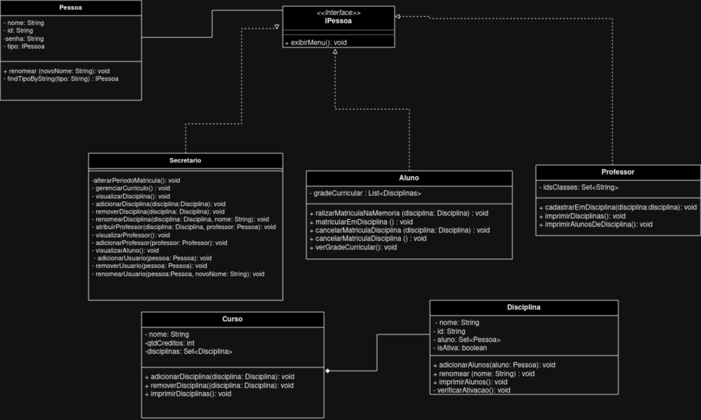
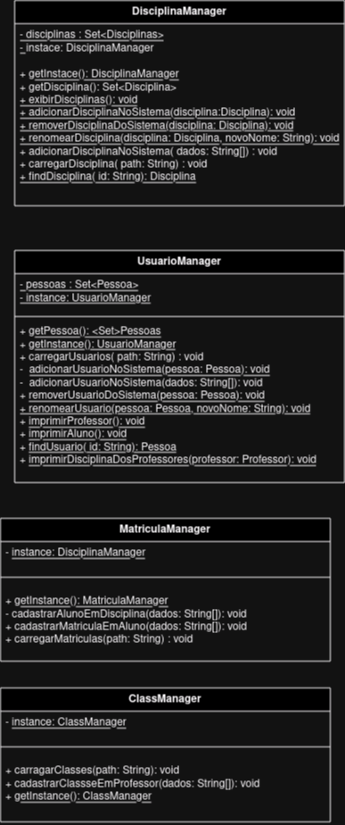

# Descrição do sistema

Uma universidade pretende informatizar seu sistema de matrículas. A secretaria da universidade gera o currículo para cada semestre e mantém as informações sobre as disciplinas, professores e alunos. 

Cada curso tem um nome, um determinado número de créditos e é constituído por diversas disciplinas.

Os alunos podem se matricular em 4 disciplinas como 1ª opção (obrigatórias) e em mais 2 outras alternativas (optativas).

Há períodos para efetuar matrículas, durante os quais um aluno pode acessar o sistema para se matricular em disciplinas e/ou para cancelar matrículas feitas anteriormente.

Uma disciplina só fica ativa, isto é, só vai ocorrer no semestre seguinte se, no final do período de matrículas tiver, pelo menos, 3 alunos inscritos (matriculados). Caso contrário, a disciplina será cancelada. O número máximo de alunos inscritos a uma disciplina é de 60 e quando este número é atingido, as inscrições (matrículas) para essa disciplina são encerradas.

Após um aluno se inscrever para um semestre, o sistema de cobranças é notificado pelo sistema de matrículas, de modo que o aluno possa ser cobrado pelas disciplinas daquele semestre.

Os professores podem acessar o sistema para saber quais são os alunos que estão matriculados em cada disciplina.

Todos os usuários do sistema têm senhas que são utilizadas para validação do respectivo login.

## Histórias de Usuário
- Eu, como **aluno da universidade**, gostaria de me matricular em disciplinas para montar minha grade curricular do semestre letivo.
- Eu, como **aluno da universidade**, gostaria cancelar uma matrícula para me desinscrever de uma matéria caso eu desista de realizá-la.
- Eu, como **aluno da universidade**, gostaria de fazer login no sistema para proteger meus dados pessoais.
- Eu, como **professor da universidade**, gostaria de visualizar os alunos matriculados em uma disciplina para gerenciar a turma.
- Eu, como **funcionário da secretaria universitária**, gostaria de gerar currículos de cada semestre letivo contendo as respectivas disciplinas de cada curso.
- Eu, como **funcionário da secretaria universitária**, gostaria de criar, editar, remover e visualizar informações sobre disciplinas, professores e alunos.

## Diagrama de Caso de Uso

## Diagramas de Classes
### Models

### Managers

### Sistema

